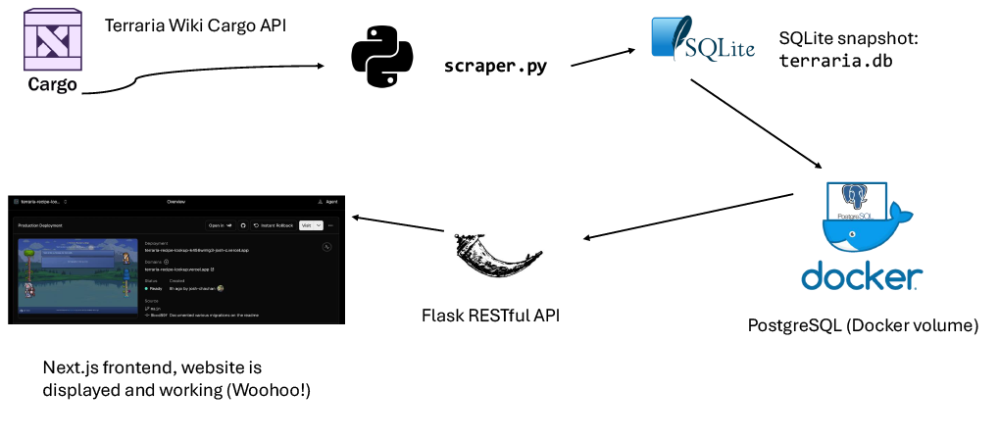

# Architecture

This document describes the current architecture and the rationale behind its
main technology choices. It uses a lightweight ADR-style format: context,
decision, consequences, and alternatives.

## System overview

Essentially the system is split into three services:

(Remove docker step from diagram for the actual hosted website)

(1) The scraper reads structured data from the Terraria Wiki's Cargo API and
stores a snapshot in SQLite. If using Docker for containerized deployment, that snapshot is
imported into PostgreSQL. (2) Flask serves search, item detail, recipe tree, and
image-proxy endpoints. (3) The Next.js frontend calls those endpoints and its /api
rewrite forwards requests to Flask.

(1) **Hosted website:** Vercel hosts the Next.js frontend. Its API requests
are forwarded to the Flask backend hosted on Render. The Render service reads
the checked-in `terraria.db` SQLite file.

(2) **Optional Docker Compose setup:** Running `docker compose up` locally
starts the Next.js frontend, Flask API, and PostgreSQL together. The API imports the checked-in SQLite snapshot into PostgreSQL on its initial startup,
storing its data in a Docker volume. This gives the project a reproducible,
multi-service setup.

  I chose to add a dockerfile and implementation for postgres due to it being a common practice, and it is good to be able to do this on a higher scale. But when the webpage is loaded on vercel, it pulls from the backend hosted on Render, with the checked in terraria.db file.

**Dataset is mostly read-only, so SQLite is sufficient for the needs of this project.**

The scraper builds or refreshes the SQLite snapshot from the Terraria Wiki's
Cargo API. SQLite is therefore both the scraper's output and the database used
by the current Render service. PostgreSQL is used by the Docker Compose path,
not automatically by Vercel or Render.

## Decision 1: SQLite

**Status:** Accepted

### Context

The dataset of Terraria items, recipes, and
ingredients is mostly read-ony. So the scraper already writes that data to `terraria.db`, and the
hosted Flask service on Render uses the checked-in database file. Frequent writes, are not necessary, as new items do not get added very frequently.

### Decision

Use SQLite as the database for the hosted Flask service. Treat the checked-in
`terraria.db` file as the generated dataset snapshot: refresh it with the
scraper and deploy the updated file when the wiki data changes. Keep the
PostgreSQL import available for the separate Docker Compose setup, but do not
assume that Vercel or Render uses PostgreSQL.

### Consequences

- **Because Render is a free service, initial startup time for the site's backend take around 30 seconds, paid hosting options would be optimal for UX**
- The hosted API can query the existing dataset without a separate database
  service, credentials, or network connection.
- Updating the hosted dataset requires regenerating and deploying the
  database snapshot.
- Less suited than a server database to multiple or concurrent writes. Runtime write dependency is not a good idea.
- The optional Compose setup adds PostgreSQL and an import step, so the repo
  supports two database paths that must remain behaviorally consistent.

### Alternatives considered

- **PostgreSQL:** Used by the optional Docker Compose stack. It is a suitable
  server database if the app needs concurrent writes, multiple API instances,
  or independently managed persistent data, but adds setup and maintenance
  that the current hosted read-only workload does not require.
- **MySQL or another relational database:** Could represent the same
  relationships, but would also require a separate service and a migration
  from the scraper's SQLite output.
- **NoSQL/document database:** Could store recipe data as documents, but
  ingredient-to-recipe lookups naturally fit relational queries. A document
  design could require duplicated data or additional indexing and lookup
  logic.

## Decision 2: Use Flask for the backend API

**Status:** Accepted

### Context

It was very quick to make in an abstract language like Python, Flask being light was a good fit for this implementation. The project only needed a small backend to query the item dataset, return JSON for the frontend, construct bounded recipe trees, and proxy wiki images. 

### Decision

Use Flask to provide the HTTP API hosted on Render and retain support for
serving the legacy static interface. The same Flask app can also run as part
of the local Docker Compose setup.

### Consequences

- Although a JS backend would make sense to maintain consistency in the frontend, The API stays in the same language and ecosystem as the scraper and database-import code.
- **Flask leaves application structure and many conventions to the project.**
  As the API grows, validation, error handling, database lifecycle, and
  endpoint organization may need more explicit structure.
- Flask's built-in server is meant just for development. Production level deployment would probably employ what the Docker Compose setup has to offer.

### Alternatives considered

- **A JavaScript/TypeScript backend:** Could consolidate the frontend and
  backend language, but would separate the API from the existing Python
  scraper and import workflow.

## Decision 3: Use Next.js for the frontend 

**Status:** Accepted

### Context
I mean, its kind of a no brainer in terms of frontend. Next.js is a good developlment experience, and industry standard for React applications. The app needs an interactive search and recipe-browsing interface, and the browser should be able to make API requests through the frontend origin. React is perfect for this.

### Decision

Use Next.js with React and TypeScript for the frontend. Configure a rewrite
from `/api` to the Flask service so the frontend can call the API using
same-origin paths.

### Consequences

- React provides a component model for the interactive search, item details,
  and ingredient tree.
- TypeScript makes the API response shapes explicit in frontend code.
- The rewrite keeps API calls on the frontend origin and avoids requiring
  browser-facing cross-origin configuration for this setup.
- Next.js provides a standard app structure and production build workflow.
- It introduces a Node.js runtime/build and a separate frontend service,
  increasing deployment and maintenance complexity compared with a static
  frontend.
- The main interface currently fetches data in the browser. It is not relying
  on server rendering for the lookup flow, so Next.js's SSR and static
  generation capabilities are available options rather than requirements of
  the current page.

### Alternatives considered

- **Static HTML/CSS/JavaScript:** Would be simpler to deploy and is still
  represented by the legacy interface, but offers less structure for the
  current interactive UI.
- **A different React framework or a client-side bundler:** Could also build
  the interface. Next.js was selected for its established React app structure
  and integrated build tooling; the current UI does not require framework-
  specific server rendering.

